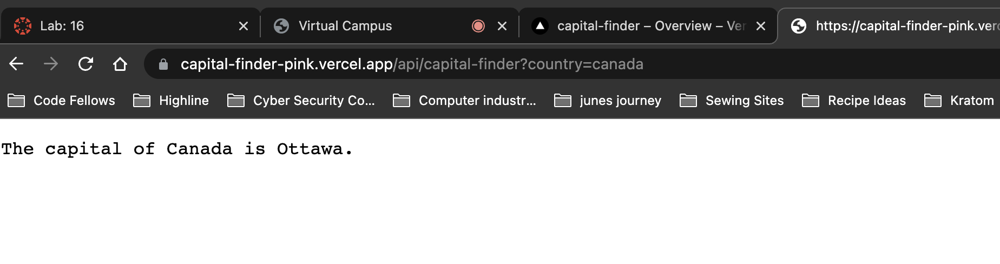
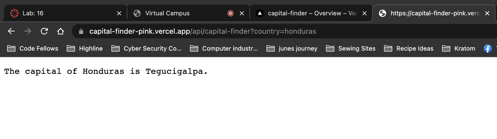
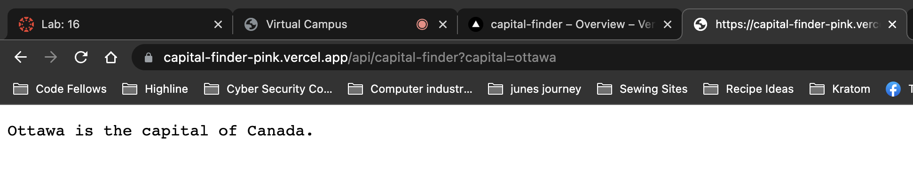
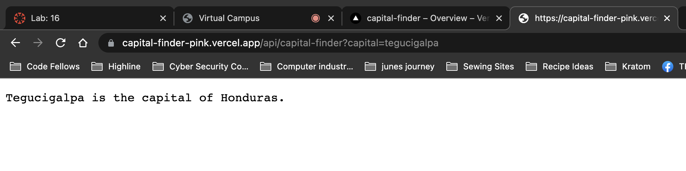
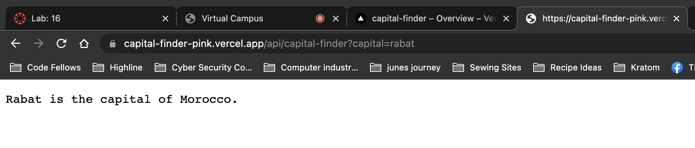
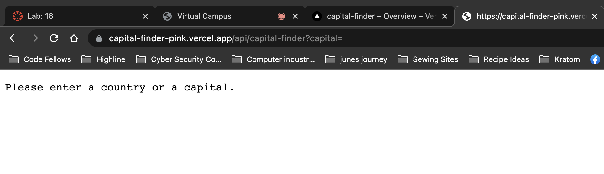

# LAB - Class 16
## Project: Serverless Functions
### Author: Rachel Freeland
### Links and Resources

[Vercel](https://capital-finder-c5kmo2984-rachel-freeland.vercel.app/api/capital-finder)

Click on the link to Vercel. When the app opens, place a`?country=` or `?capital=` in the address bar at the end of the 
app address followed by the country or capital that you wish to look up.

### Images of the app in action

 
 

 
 

 
 

 
 

 
 

